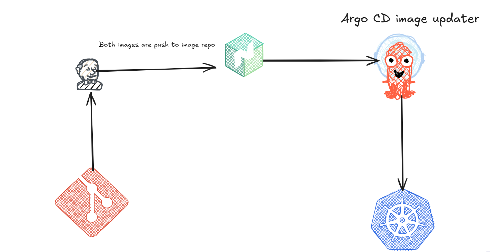
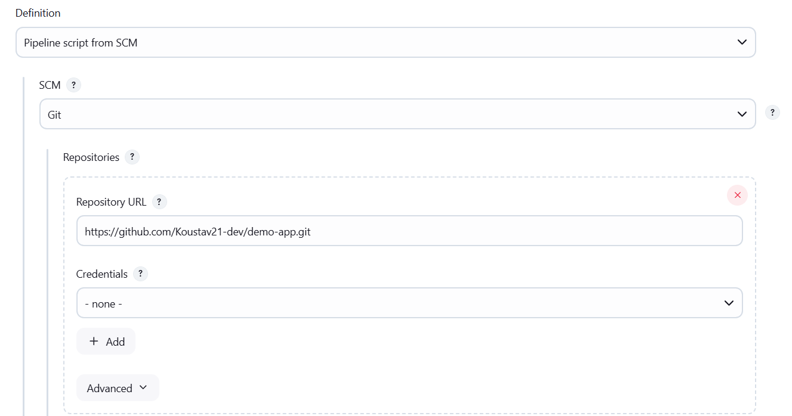

# Demo app flow


# CI Flow
## 1. create app and push into github

```
https://github.com/Koustav21-dev/demo-app.git
```
## 2. Set up Jenkins 
- Select poll scm with a time of 5 min:
```
H/5 * * * *
```
- Pipeline definition select *__pipeline script from scm__*

- Go to manage jenkins and under credentials set your nexus credentials

- Next under manage jenkins->tools set path to your git.exe

## 3. Set up Nexus
- Set up nexus via wsl in your system
```
https://help.sonatype.com/en/install-nexus-repository.html
```
- Note the ip of your wsl vm 
```
ipconfig
```
- create a docker hosted repo in nexus


- Trigger build to see your image get push into nexus

# CD flow
> Pre-requisites: Minikube installed
## ArgoCD install
- Delete your existing minikube cluster
- Run the command
```
minikube start --insecure-registry "<registry-IP>"
```
- Install argocd
```
kubectl create namespace argocd

kubectl apply -n argocd -f https://raw.githubusercontent.com/argoproj/argo-cd/stable/manifests/install.yaml

```

- Access UI

```
kubectl port-forward svc/argocd-server -n argocd 80xx:x43

```
- Access through local browser

- Login with username: admin and password:
```
kubectl -n argocd get secret argocd-initial-admin-secret -o jsonpath="{.data.password}" | base64 -d
```

- Set up your nexus secret for both default and argocd namespace

```
kubectl create secret docker-registry nexus-reg-cred \
  --docker-server=172.18.X.XX:2000 \
  --docker-username=admin \
  --docker-password=admin12
```
```
kubectl create secret docker-registry nexus-reg-cred \
  --docker-server=172.18.X.XX:2000 \
  --docker-username=admin \
  --docker-password=admin12 -n argocd
 ```

- Write all your K8S manifest as well as argocd manifest

- Edit argocd configmap to add following code:
```
kubectl edit configmap argocd-image-updater-config -n argocd
```
```
apiVersion: v1
kind: ConfigMap
metadata:
  name: argocd-image-updater-config
  namespace: argocd
  labels:
    app.kubernetes.io/name: argocd-image-updater-config
    app.kubernetes.io/part-of: argocd-image-updater
data:
  registries.conf: |
    registries:
      - name: nexus
        api_url: http://172.18.196.94:7000
        prefix: 172.18.196.94:7000
        insecure: true
        credentials: pullsecret:argocd/nexus-reg-cred

```

- Check nexus cred are valid

```
kubectl get secret nexus-reg-cred -n argocd -o jsonpath='{.data.\.dockerconfigjson}' | base64 -d
```
- restart the image updater
```
kubectl rollout restart deployment/argocd-image-updater -n argocd
```
- Run your argocd manifest file 


- Check logs through commands and in case of error debug

```
kubectl logs -n argocd deployment/argocd-image-updater -f | grep demo-app
```

or

```
kubectl logs -n argocd deployment/argocd-image-updater -f
```

> Note: Sometimes we may see permission error like this"
```
(field: '.dockerconfigjson'): secrets \"nexus-reg-cred\" is forbidden: User \"system:serviceaccount:argocd:argocd-image-updater\" cannot get resource \"secrets\" in API group \"\" in the namespace \"default\"" alias=demo application=demo-app image_name=demo-app image_tag=1 registry="172.18.196.94:7000"
```

> Just add this yaml file to configure permission

```
apiVersion: rbac.authorization.k8s.io/v1
kind: Role
metadata:
  name: read-nexus-secret
  namespace: argocd
rules:
  - apiGroups: [""]
    resources: ["secrets"]
    resourceNames: ["nexus-reg-cred"]
    verbs: ["get"]
---
apiVersion: rbac.authorization.k8s.io/v1
kind: RoleBinding
metadata:
  name: allow-image-updater-to-read-nexus-secret
  namespace: argocd
subjects:
  - kind: ServiceAccount
    name: argocd-image-updater
    namespace: argocd
roleRef:
  kind: Role
  name: read-nexus-secret
  apiGroup: rbac.authorization.k8s.io

```